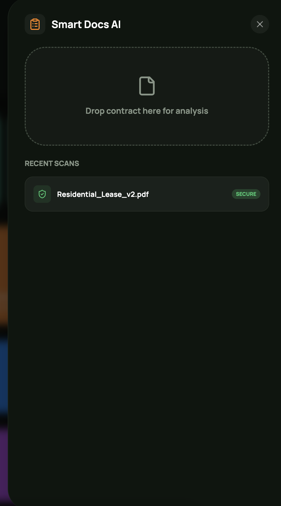
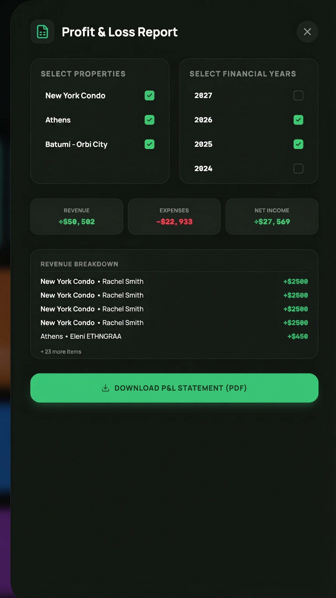
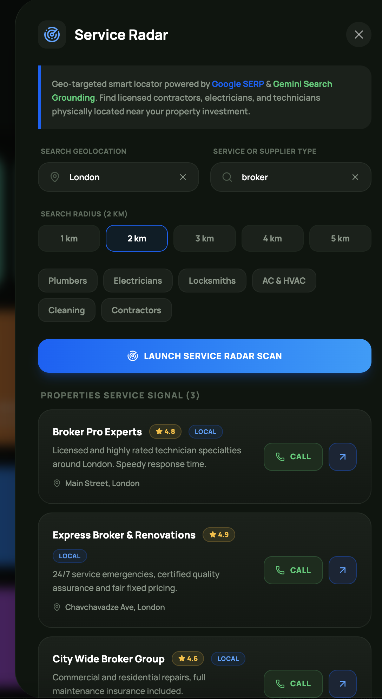
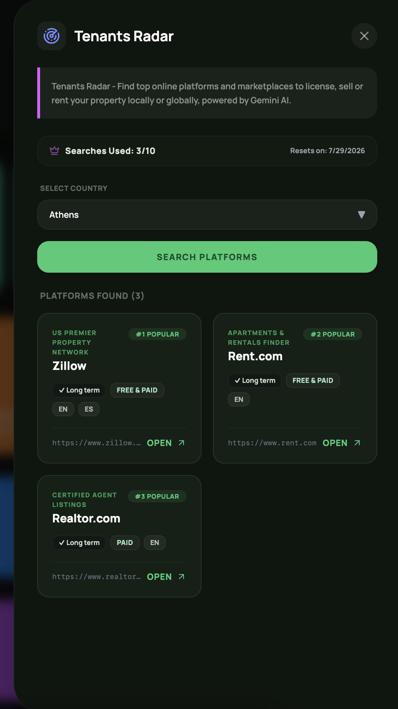

The **Tools & AI** page provides a collection of useful tools designed to speed up and simplify your workflow.

Some tools offer simple yet valuable utilities (such as a Calculator and Currency Converter), while others leverage AI to generate powerful insights and analysis about your properties.

<Frame caption="Tool & AI">
  
</Frame>

### AI Portfolio Assistant

Leverage the AI Portfolio Assistant for real-time insights, performance analysis, and optimization opportunities across your property portfolio. Simply enter your queries to receive data-driven recommendations on valuation, yield, and tax strategies.

<Frame caption="AI Portfolio Assistant">
  
</Frame>

### ROI Prediction

This feature provides ROI estimations for your properties by analyzing external factors such as geopolitical trends, economic growth, and other market conditions in the areas where your properties are located.   

<Frame caption="ROI Prediction">
  
</Frame>

<Note>
  **Note:** AI-generated insights are based on automated calculations and analysis. They are intended to provide guidance but cannot be guaranteed to be 100% accurate.
</Note>

### Mortgage Estimator

<Frame caption="Mortgage Estimator">
  
</Frame>

<Note>
  **Note:** This estimator calculates baseline Principal and Interest (P&I) only. Actual monthly payments may vary globally depending on local property taxes, home insurance, regional compounding rules, and lender-specific fees..
</Note>

### Yield Calculator

Calculate the estimated yield and potential returns of your properties.

<Frame caption="Mortgage Estimator">
  
</Frame>

### Smart Docs AI

PropertyGenius Smart Docs AI tool allows you to scan documents (such as purchase contracts), summarize their content, and highlight the most important points to review.

<Frame caption="Mortgage Estimator">
  
  
</Frame>

### Contracts Generator

Select the desired country and language, and the Contracts Generator will create a standard property sale or rental contract for you.

<Frame caption="Contracts Generator">
  
</Frame>

### Profit & Loss Report

The Profit & Loss Report generates a standard P&L statement that you can share with your accountant.

<Frame caption="Profit & Loss">
  
  
</Frame>

### Services Search

Find nearby professionals and service providers, such as cleaners, brokers, plumbers, and more, near your property.

<Frame caption="Service Search">
  
  
</Frame>

### Tenants Radar

This feature helps you find the most popular platforms to advertise your property for rent or sale.

<Frame caption="Tenanats Radar">
  
  
</Frame>